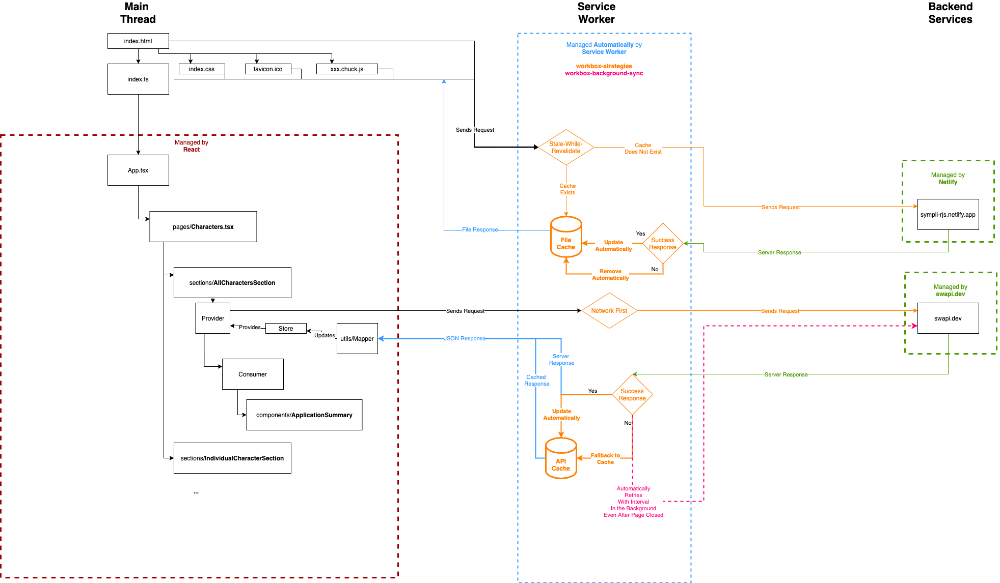

# MilliFX App

React Application which showcases Investment Performance.

[Live Site](https://millifx.netlify.app) | [UI Library](https://millifx.netlify.app/storybook/index.html) | [UI Docs](https://millifx.netlify.app/docs/index.html) | [Bundle Explorer](https://millifx.netlify.app/explorer.html) | [Tech Stacks](app/docs/STACK.md)

This project was created with [Create React App](./docs/CRA.md).

It is also an installable, Offline-First PWA, allowing users to use it even when offline.

## Application Architecture

.